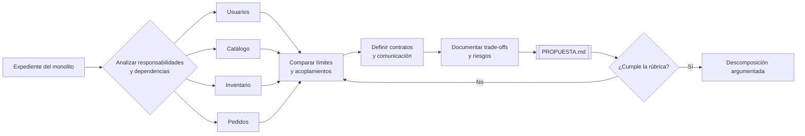

# Análisis de un monolito y propuesta de servicios

## Información de la práctica

| Campo | Valor |
|---|---|
| **Duración contractual** | **24 minutos** |
| **Complejidad** | Fácil |
| **Producto** | `PROPUESTA.md` |
| **Caso** | Tienda en línea: usuarios, productos, inventario y pedidos |

## Objetivo

Analizar un monolito de tienda en línea, reconocer sus límites y dependencias, y proponer una descomposición razonada en servicios. La práctica aplica límites de negocio, cohesión, acoplamiento, autonomía y trade-offs.

## Mapa del laboratorio



El recorrido transforma evidencias del monolito en una propuesta verificable: primero separará responsabilidades, después justificará los límites y finalmente comprobará contratos y trade-offs.

## Prerrequisitos

- Haber revisado el capítulo 1 de la PPT.
- Poder crear y editar un archivo Markdown.
- No es necesario programar ni ejecutar infraestructura.

## Presupuesto de tiempo

| Actividad | Minutos |
|---|---:|
| Comprender el escenario y revisar evidencias | 4 |
| Detectar acoplamientos y dependencias | 5 |
| Comparar alternativas de límites | 5 |
| Elaborar propuesta y diagrama | 6 |
| Contratos, trade-offs y validación | 4 |
| **TOTAL** | **24** |

> La ruta principal termina al completar la validación final. Las ampliaciones se conservan al final como referencia y no forman parte de los 24 minutos.

## Caso de análisis

El monolito ejecuta en un solo proceso las funciones de usuarios, catálogo, inventario y pedidos. Todos los módulos comparten la misma base de datos SQLite.

```text
Cliente → Aplicación Flask → Usuarios / Productos / Inventario / Pedidos
                              ↓
                     Base de datos compartida
```

Observe estas operaciones representativas:

```python
def crear_producto(datos):
    producto_id = guardar_producto(datos)
    crear_registro_inventario(producto_id, cantidad=0)
    return producto_id

def crear_pedido(usuario_id, items):
    validar_usuario(usuario_id)
    for item in items:
        validar_producto(item["producto_id"])
        verificar_stock(item["producto_id"], item["cantidad"])
    pedido = guardar_pedido(usuario_id, items)
    descontar_inventario(items)
    return pedido
```

El objetivo no es corregir el código. Úselo como evidencia para identificar responsabilidades mezcladas y dependencias de cambio.

### Expediente del monolito

Además del código, el equipo reporta estas situaciones:

1. Una modificación del esquema de productos obliga a coordinar a Catálogo, Inventario y Pedidos.
2. Durante campañas comerciales, Pedidos consume mucha CPU, pero solo puede escalarse toda la aplicación.
3. Un fallo al descontar inventario puede ocurrir después de crear el pedido.
4. El equipo de Catálogo no puede desplegar sin ejecutar las pruebas completas de Usuarios y Pedidos.
5. Todos los módulos leen y escriben directamente sobre las mismas tablas.
6. Los cambios de precio deben reflejarse en pedidos nuevos, pero no alterar pedidos históricos.
7. Usuarios cambia con poca frecuencia; Catálogo e Inventario reciben cambios diarios.
8. La aplicación funciona correctamente para la carga actual; migrarla también introduce coste y riesgo.

Clasifique cada evidencia como problema de datos compartidos, dependencia de código, despliegue, escalado, consistencia o estructura de equipos. Algunas evidencias pueden pertenecer a más de una categoría.

## Paso 1 — Identificar dependencias

**Tiempo sugerido: 5 minutos**

Complete esta tabla en `PROPUESTA.md`. Las dos primeras filas sirven de ejemplo; resuelva al menos cuatro evidencias adicionales:

| Evidencia | Consecuencia | Límite candidato |
|---|---|---|
| Una base de datos compartida | Los cambios de esquema afectan varios módulos | Propiedad de datos por dominio |
| Crear un producto también crea inventario | Catálogo e inventario cambian juntos | Catálogo / Inventario |
| ... | ... | ... |
| ... | ... | ... |

Añada una dependencia adicional o explique por qué las cuatro cubren el caso.

## Paso 2 — Comparar alternativas de límites

**Tiempo sugerido: 5 minutos**

Compare estas alternativas antes de elegir. Ninguna es automáticamente correcta:

| Alternativa | Límites | Ventaja | Riesgo |
|---|---|---|---|
| A: separación amplia | Usuarios / Catálogo / Inventario / Pedidos | Escalado y propiedad claros | Más llamadas y operación |
| B: catálogo unificado | Usuarios / Catálogo+Inventario / Pedidos | Menos coordinación inicial | Catálogo e inventario evolucionan juntos |
| C: monolito modular | Cuatro módulos dentro de un despliegue | Menor coste de transición | Sin escalado ni despliegue independiente |

Elija una alternativa o proponga otra. Para cada límite escriba una responsabilidad incluida, una excluida, el dato del que es propietario y una razón de cohesión o autonomía. Considere la carga actual: conservar temporalmente un monolito modular es una decisión válida si está bien justificada.

### Mapa de límites

Complete un diagrama breve. Sustituya los nombres y flechas según su decisión:

```text
Cliente
  |
  +--> [________________]
  +--> [________________] ----consulta/reserva----> [________________]
  +--> [________________]

Propiedad de datos:
[____________] → [datos propios]
[____________] → [datos propios]
```

## Paso 3 — Definir contratos mínimos

Esta actividad se integra en los cuatro minutos finales junto con los trade-offs y la validación.

Documente solo las interacciones necesarias para crear un pedido:

| Origen | Destino | Intención | Contrato mínimo |
|---|---|---|---|
| Pedidos | Usuarios | Validar cliente | `GET /users/{id}` |
| Pedidos | Productos | Consultar producto y precio | `GET /products/{id}` |
| Pedidos | Inventario | Reservar unidades | `POST /inventory/{id}/reservations` |

Indique un posible fallo de red y cómo debería responder Pedidos. No diseñe todavía API Gateway, broker ni service mesh.

Use uno de estos escenarios para concretar la decisión:

- Inventario no responde antes de crear el pedido.
- Inventario confirma una reserva, pero Pedidos falla antes de guardar el pedido.
- Productos cambia el precio mientras se procesa la solicitud.

No es necesario implementar la solución. Documente si rechazaría, reintentaría, compensaría o registraría el caso para reconciliación, y explique el trade-off.

## Paso 4 — Elaborar `PROPUESTA.md`

**Tiempo sugerido: 6 minutos**

```markdown
# Propuesta de descomposición
## 1. Problemas observados
## 2. Servicios y límites
| Servicio | Responsabilidad | Datos propios | Fuera de alcance |
## 2.1 Diagrama propuesto
## 3. Comunicación necesaria
| Origen | Destino | Contrato | Fallo considerado |
## 4. Trade-offs
- Beneficio esperado: ...
- Complejidad añadida: ...
- Decisión que requiere validación: ...
```

## Validación final

**Tiempo sugerido: 4 minutos, junto con contratos y trade-offs**

- [ ] Identifica al menos cuatro dependencias o responsabilidades mezcladas.
- [ ] Propone límites por capacidad de negocio y asigna propietario a los datos.
- [ ] Define las tres interacciones mínimas del flujo de pedido.
- [ ] Incluye un fallo o trade-off; no presenta microservicios como solución universal.
- [ ] Evita tecnologías fuera del alcance del capítulo.

```bash
test -f PROPUESTA.md && grep -q "Trade-offs" PROPUESTA.md && echo "Validación documental: OK"
```

### Rúbrica rápida

| Criterio | 0 | 1 | 2 |
|---|---|---|---|
| Evidencia | Sin evidencias | Enumera problemas | Relaciona evidencia y consecuencia |
| Límites | División técnica | Responsabilidades parciales | Capacidades y exclusiones claras |
| Datos | Compartidos sin análisis | Propietario ambiguo | Propiedad explícita por límite |
| Contratos y fallos | No aparecen | Contratos sin fallo | Contratos con respuesta ante fallo |
| Trade-offs | Solo beneficios | Riesgo genérico | Beneficio, coste y decisión pendiente |

Una propuesta con 7 puntos o más está lista para discutirse en grupo. La puntuación no determina una arquitectura “correcta”; verifica que la decisión esté argumentada.

## Resultado esperado

Un `PROPUESTA.md` conciso y justificable que sirva como referencia conceptual para crear `products-service` en el capítulo 2. No se espera una arquitectura lista para producción ni código de los cuatro servicios.

## Solución rápida de problemas

- Si parece una lista de tablas, reformule cada servicio como capacidad de negocio.
- Si todos comparten base de datos, asigne propiedad de datos y contratos entre límites.
- Si resulta extensa, conserve solo evidencia, límites, contratos y trade-offs.
- No hay una única respuesta correcta: se evalúan la justificación y la claridad.


## Recursos

- https://martinfowler.com/articles/microservices.html
- https://www.domainlanguage.com/ddd/reference/
- https://microservices.io/patterns/decomposition/decompose-by-business-capability.html
