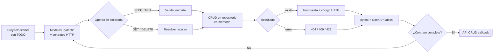

# Crear una API REST simple en FastAPI

## Información de la práctica

| Campo | Valor |
|---|---|
| **Duración contractual** | **40 minutos** |
| **Complejidad** | Media |
| **Producto** | API CRUD de productos con pruebas |
| **Tecnologías** | Python, FastAPI, Pydantic, pytest |

## Objetivo

Crear una API REST simple para `products-service`, aplicando recursos, contratos, validación, códigos HTTP, manejo de errores y documentación OpenAPI. El servicio usa memoria para mantener el foco en el diseño HTTP; la persistencia se aborda en capítulos posteriores.

## Mapa del laboratorio



El objetivo es completar el circuito entero de una API: contrato, validación, comportamiento, errores y evidencia automática mediante pruebas y OpenAPI.

## Prerrequisitos

- Python 3.12 y `pip` disponibles.
- Conocimientos básicos de funciones, tipos y HTTP.
- La propuesta del laboratorio 1 como contexto; no es necesario reconstruirla.

## Presupuesto de tiempo

| Actividad | Minutos |
|---|---:|
| Preparar y explorar el proyecto | 5 |
| Completar modelos y contratos | 8 |
| Implementar operaciones CRUD | 14 |
| Ejecutar y completar pruebas | 9 |
| Revisar OpenAPI y cierre | 4 |
| **TOTAL** | **40** |

## Arquitectura

```text
Cliente HTTP → FastAPI → validación Pydantic → repositorio en memoria
                    └── OpenAPI /docs
```

La carpeta `starter/products-service` contiene una base parcialmente implementada. La carpeta `solution/products-service` permite comparar y validar al finalizar; no la consulte antes de intentar los pasos principales.

## Paso 1 — Preparar y explorar

**Tiempo sugerido: 5 minutos**

```bash
cd Capitulo02
cp -R starter/products-service products-service
cd products-service
python -m venv .venv
source .venv/bin/activate
python -m pip install -r requirements.txt
```

En PowerShell active el entorno con:

```powershell
.\.venv\Scripts\Activate.ps1
```

Revise `app/main.py` y localice los marcadores `TODO`. La API parte con `GET /products` y `POST /products`; deberá completar consulta individual, actualización y eliminación.

## Paso 2 — Completar modelos y contratos

**Tiempo sugerido: 8 minutos**

Revise estos contratos en `app/main.py`:

- `ProductCreate`: nombre, precio mayor que cero y stock no negativo.
- `ProductUpdate`: campos opcionales para actualización parcial.
- `Product`: representación de salida con identificador.

Antes de programar, complete esta tabla:

| Operación | Método y ruta | Éxito | Error relevante |
|---|---|---:|---:|
| Listar | `GET /products` | 200 | — |
| Crear | `POST /products` | 201 | 422 |
| Consultar | `GET /products/{id}` | 200 | 404 |
| Actualizar | `PUT /products/{id}` | 200 | 404/422 |
| Eliminar | `DELETE /products/{id}` | 204 | 404 |

Observe que `422` lo produce la validación de entrada de FastAPI/Pydantic; `404` debe producirlo explícitamente la aplicación cuando el recurso no existe.

## Paso 3 — Implementar el CRUD

**Tiempo sugerido: 14 minutos**

Complete los tres `TODO` de `app/main.py`.

### Consulta individual

1. Busque el identificador en `products`.
2. Si no existe, lance `HTTPException(status_code=404, ...)`.
3. Devuelva el producto encontrado.

### Actualización

1. Compruebe primero que el recurso existe.
2. Obtenga solo los campos enviados con `model_dump(exclude_unset=True)`.
3. Combine esos valores con el producto actual sin cambiar el `id`.
4. Devuelva la representación actualizada.

### Eliminación

1. Responda `404` si no existe.
2. Elimine el elemento del repositorio.
3. Devuelva `Response(status_code=204)` sin cuerpo.

No añada base de datos, autenticación, Docker ni capas adicionales. El objetivo es practicar el contrato HTTP de un recurso.

## Paso 4 — Ejecutar y probar

**Tiempo sugerido: 9 minutos**

```bash
pytest -q
```

La primera ejecución debe mostrar qué comportamiento falta. Use los fallos como guía y vuelva a ejecutar hasta obtener:

```text
7 passed
```

Las pruebas cubren:

- lista inicialmente vacía;
- creación válida;
- rechazo de precio inválido;
- consulta existente e inexistente;
- actualización parcial;
- eliminación y respuesta sin cuerpo.

Si una prueba falla, compare método, ruta, código HTTP y cuerpo recibido antes de cambiar el código.

Prueba manual opcional:

```bash
uvicorn app.main:app --reload
curl -s http://127.0.0.1:8000/products
```

## Paso 5 — Revisar OpenAPI

**Tiempo sugerido: 4 minutos**

Con Uvicorn activo, abra `http://127.0.0.1:8000/docs` y compruebe:

- [ ] aparecen las cinco operaciones;
- [ ] el esquema exige `name`, `price` y `stock` al crear;
- [ ] los campos de actualización son opcionales;
- [ ] `POST` documenta 201 y `DELETE` documenta 204;
- [ ] los cuerpos de respuesta usan el modelo `Product`.

## Validación final

```bash
python -m compileall -q app
pytest -q
python -c "from app.main import app; assert len(app.routes) >= 9; print('API: OK')"
```

La práctica queda completa si las siete pruebas pasan y la documentación muestra el contrato esperado.

## Resultado esperado

Una API pequeña pero funcional que demuestra:

- modelado y validación con Pydantic;
- rutas orientadas a recursos;
- códigos 200, 201, 204, 404 y 422;
- actualización parcial controlada;
- pruebas con `TestClient`;
- documentación OpenAPI generada por FastAPI.

## Preguntas de cierre

1. ¿Por qué un identificador inexistente produce 404 y no 422?
2. ¿Por qué la respuesta 204 no debe incluir JSON?
3. ¿Qué limitación introduce el repositorio en memoria?
4. ¿Qué parte del contrato debe permanecer estable al cambiar posteriormente la persistencia?

## Solución rápida de problemas

- `ModuleNotFoundError`: active `.venv` y ejecute `python -m pip install -r requirements.txt`.
- El puerto 8000 está ocupado: use `uvicorn app.main:app --port 8001`.
- La actualización borra campos: use `exclude_unset=True`.
- `DELETE` devuelve contenido: construya una respuesta 204 sin cuerpo.
- Las pruebas contaminan otras pruebas: conserve el fixture que limpia `products`.


## Fuentes

- https://fastapi.tiangolo.com/tutorial/body/
- https://fastapi.tiangolo.com/tutorial/handling-errors/
- https://fastapi.tiangolo.com/tutorial/testing/
