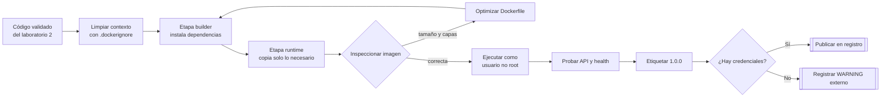

# Construir y publicar una imagen Docker

## Información de la práctica

| Campo | Valor |
|---|---|
| **Duración contractual** | **41 minutos** |
| **Complejidad** | Media |
| **Producto** | Imagen `products-service:1.0.0` |
| **Tecnologías** | Docker, Python y FastAPI |

## Objetivo

Construir, verificar, etiquetar y publicar una imagen Docker del `products-service`, aplicando un contexto de build limpio, capas aprovechables, una etapa de runtime mínima y ejecución con usuario no root.

## Mapa del laboratorio



La práctica cubre el ciclo de entrega de una imagen: contexto reproducible, build multi-stage, controles de seguridad, prueba en ejecución y publicación versionada.

## Prerrequisitos

- Docker Engine o Docker Desktop con el daemon activo.
- Cuenta y repositorio en Docker Hub para completar la publicación.
- Solución validada del laboratorio 2 en `Capitulo02/solution/products-service`.
- Conexión a Internet para descargar la imagen base y publicar.

Si no dispone de credenciales de Docker Hub, complete build, ejecución y etiquetado; registre la publicación como `WARNING externo`, no como `PASS`.

## Presupuesto de tiempo

| Actividad | Minutos |
|---|---:|
| Preparación y contexto | 4 |
| `.dockerignore` y estrategia de capas | 5 |
| Dockerfile multi-stage | 9 |
| Build y análisis | 8 |
| Ejecución y validación | 7 |
| Etiquetado y publicación | 6 |
| Cierre y margen | 2 |
| **TOTAL** | **41** |

## Flujo

```text
Código + requirements
        ↓ docker build
Etapa builder → dependencias instaladas
        ↓ copia selectiva
Etapa runtime → usuario no root → Uvicorn :8000
        ↓ tag / push
Registro de contenedores
```

La carpeta `starter` contiene archivos incompletos para trabajar; `solution` contiene la referencia final.

## Paso 1 — Preparar el contexto

**Tiempo sugerido: 4 minutos**

Desde la raíz del repositorio:

```bash
cp -R Capitulo02/solution/products-service products-service
cp Capitulo03/starter/.dockerignore products-service/.dockerignore
cp Capitulo03/starter/Dockerfile products-service/Dockerfile
cd products-service
docker version
```

Compruebe que el contexto contiene `app/`, `tests/`, `requirements.txt`, `.dockerignore` y `Dockerfile`. No copie el entorno virtual generado durante el laboratorio anterior.

## Paso 2 — Revisar `.dockerignore`

**Tiempo sugerido: 5 minutos**

Abra `.dockerignore` y explique por qué se excluyen:

- `.venv`, `__pycache__` y cachés de pruebas;
- `.git` y archivos del editor;
- `.env` y archivos de secretos;
- tests y documentación que no requiere la imagen de runtime.

Valide primero las reglas de exclusión, sin intentar construir todavía el Dockerfile incompleto:

```bash
grep -E '^\.venv|^\.git|^\.env|^tests' .dockerignore
```

Debe encontrar reglas para `.venv`, `.git`, `.env` y tests. La comprobación del contexto enviado a Docker se realiza después de completar el Dockerfile.

## Paso 3 — Completar el Dockerfile

**Tiempo sugerido: 9 minutos**

El archivo inicial tiene cuatro marcadores `TODO`. Complételos usando `Capitulo03/solution/Dockerfile` solo si necesita desbloquearse.

Decisiones que debe poder justificar:

1. Copiar `requirements.txt` antes del código permite reutilizar la capa de dependencias.
2. La etapa builder instala paquetes sin incluir herramientas de compilación en runtime.
3. La imagen final crea un usuario sin privilegios.
4. `COPY --chown` evita que los archivos queden propiedad de root.
5. `CMD` usa la forma JSON para manejar correctamente las señales del contenedor.

Comprobación estática:

```bash
grep -c '^FROM ' Dockerfile
grep -E '^USER |COPY --from=' Dockerfile
```

Debe encontrar dos instrucciones `FROM`, una copia desde builder y un `USER` no root.

Ahora sí construya una imagen de comprobación y revise la salida para confirmar que `.venv`, `.git` y `.env` no se envían al contexto:

```bash
docker build --no-cache --progress=plain -t products-service:context-check .
```

## Paso 4 — Construir y analizar

**Tiempo sugerido: 8 minutos**

```bash
docker build -t products-service:1.0.0 .
docker image inspect products-service:1.0.0 --format '{{.Id}} | {{.Size}}'
docker history --no-trunc products-service:1.0.0
```

No use un límite universal de tamaño como criterio de aprobación. Compare el resultado con la imagen base y confirme que el historial no contiene credenciales ni archivos locales inesperados.

Verifique el usuario configurado:

```bash
docker image inspect products-service:1.0.0 --format '{{.Config.User}}'
```

El resultado esperado es `appuser`.

## Paso 5 — Ejecutar y validar

**Tiempo sugerido: 7 minutos**

```bash
docker run --rm -d --name products-api -p 8000:8000 products-service:1.0.0
docker logs products-api
curl -s http://127.0.0.1:8000/products
curl -s http://127.0.0.1:8000/openapi.json
docker exec products-api id
docker stop products-api
```

Resultados esperados:

- `/products` responde `[]` al inicio;
- OpenAPI contiene la ruta `/products`;
- `id` muestra un UID sin privilegios;
- el contenedor se detiene de forma ordenada.

En PowerShell puede sustituir `curl -s` por `Invoke-RestMethod`.

## Paso 6 — Etiquetar y publicar

**Tiempo sugerido: 6 minutos**

Defina su usuario sin escribir credenciales en archivos:

```bash
export DOCKERHUB_USER="tu-usuario"
docker tag products-service:1.0.0 "$DOCKERHUB_USER/products-service:1.0.0"
docker login
docker push "$DOCKERHUB_USER/products-service:1.0.0"
```

Use `1.0.0` como referencia reproducible. La etiqueta `latest` no forma parte de la ruta principal.

Compruebe que ambas etiquetas apuntan al mismo ID:

```bash
docker image inspect products-service:1.0.0 --format '{{.Id}}'
docker image inspect "$DOCKERHUB_USER/products-service:1.0.0" --format '{{.Id}}'
```

## Validación final

**Tiempo sugerido: 2 minutos**

- [ ] Existen `.dockerignore` y Dockerfile multi-stage.
- [ ] El contexto excluye entornos, secretos y metadatos Git.
- [ ] La imagen `products-service:1.0.0` se construye.
- [ ] El contenedor responde por HTTP.
- [ ] El proceso se ejecuta como usuario no root.
- [ ] La imagen está etiquetada con usuario y versión.
- [ ] El push terminó correctamente o quedó documentado como `WARNING externo`.

```bash
docker image inspect products-service:1.0.0 >/dev/null && echo "Imagen local: OK"
```

## Resultado esperado

Una imagen reproducible del servicio FastAPI, ejecutable sin privilegios y etiquetada como `products-service:1.0.0`. Cuando haya credenciales y conectividad, la misma imagen estará disponible en Docker Hub con el namespace del participante.

## Preguntas de cierre

1. ¿Qué cambio permite reutilizar la capa de dependencias?
2. ¿Qué archivos evita enviar `.dockerignore` y por qué importa?
3. ¿Qué riesgo reduce ejecutar como usuario no root?
4. ¿Por qué `1.0.0` es una referencia más reproducible que `latest`?

## Solución rápida de problemas

- El daemon no responde: inicie Docker Desktop o el servicio Docker.
- El puerto 8000 está ocupado: publique `-p 8001:8000`.
- El import `app.main` falla: confirme `WORKDIR /app` y que se copió `app/`.
- El push devuelve `denied`: revise `DOCKERHUB_USER`, `docker login` y la propiedad del repositorio.
- El build no reutiliza caché: confirme que `requirements.txt` se copia antes del código.


## Fuentes

- https://docs.docker.com/build/building/multi-stage/
- https://docs.docker.com/build/cache/optimize/
- https://docs.docker.com/reference/dockerfile/
