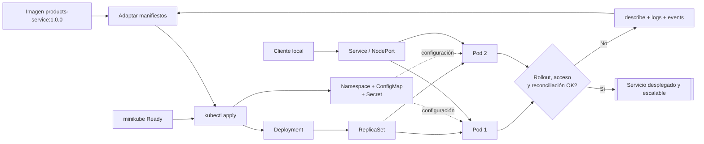

# Desplegar un servicio Python en un clúster local

## Información de la práctica

| Campo | Valor |
|---|---|
| **Duración contractual** | **41 minutos** |
| **Plataforma elegida** | minikube |
| **Producto** | Deployment y Service funcionales |
| **Objetos** | Namespace, ConfigMap, Secret, Deployment y Service |

## Objetivo

Desplegar `products-service` en un clúster Kubernetes local, separar configuración y secretos del contenedor, comprobar el rollout, acceder al servicio y escalar sus réplicas.

El temario permite minikube o kind. Esta ruta usa minikube porque los laboratorios posteriores ya dependen de él; no es necesario ejecutar ambas alternativas.

## Mapa del laboratorio



Se espera pasar del estado declarado en YAML a un servicio accesible, observar cómo Kubernetes crea sus recursos y demostrar que mantiene el número de réplicas solicitado.

## Prerrequisitos

- Docker y minikube instalados; el clúster debe poder iniciarse antes de la práctica.
- `kubectl` configurado para el contexto local.
- Imagen publicada en el laboratorio 3 como `<usuario>/products-service:1.0.0`.
- Al menos 4 GB de RAM disponibles para minikube.

> Descargar herramientas, crear cuentas o resolver problemas del hipervisor son actividades de preparación previa, no parte de los 41 minutos.

## Presupuesto de tiempo

| Actividad | Minutos |
|---|---:|
| Verificar clúster e imagen | 5 |
| Revisar y adaptar manifiestos | 10 |
| Aplicar y observar rollout | 8 |
| Acceder y diagnosticar el servicio | 8 |
| Escalar y comprobar reconciliación | 6 |
| Validación y cierre | 4 |
| **TOTAL** | **41** |

## Arquitectura

```text
Host → minikube Service/NodePort → Deployment → Pods products-service
                                      ├── ConfigMap: APP_ENV
                                      └── Secret: API_KEY de demostración
```

Los manifiestos completos están en `manifests/`. El trabajo consiste en revisarlos, reemplazar la imagen y demostrar cómo Kubernetes alcanza y conserva el estado declarado.

## Paso 1 — Verificar el entorno

**Tiempo sugerido: 5 minutos**

```bash
minikube status
minikube start --driver=docker
kubectl config current-context
kubectl get nodes
```

El nodo debe aparecer `Ready` y el contexto debe corresponder a minikube. Sustituya el marcador de imagen antes de aplicar:

```bash
grep -R "your-dockerhub-user" Capitulo04/manifests
```

Edite `03-deployment.yaml` y cambie `your-dockerhub-user` por su usuario. No cambie `1.0.0` por `latest`.

## Paso 2 — Revisar los manifiestos

**Tiempo sugerido: 10 minutos**

Relacione cada archivo con su responsabilidad:

| Archivo | Responsabilidad | Comprobación importante |
|---|---|---|
| `00-namespace.yaml` | Aislar recursos del curso | `metadata.name` |
| `01-config.yaml` | Configuración no sensible | `APP_ENV` |
| `02-secret.yaml` | Valor sensible de demostración | `stringData`, no producción |
| `03-deployment.yaml` | Pods, rollout y estado deseado | labels/selectors idénticos |
| `04-service.yaml` | Acceso estable a los Pods | `targetPort: 8000` |

Antes de enviar al clúster, valide sintaxis y estructura:

```bash
kubectl apply --dry-run=client -f Capitulo04/manifests/
```

Busque en el Deployment:

- imagen versionada;
- `containerPort: 8000`;
- variables desde ConfigMap y Secret;
- requests y limits;
- probes HTTP;
- selector que coincide con las labels del Pod.

## Paso 3 — Aplicar y observar el rollout

**Tiempo sugerido: 8 minutos**

```bash
kubectl apply -f Capitulo04/manifests/
kubectl -n microservicios-curso rollout status deployment/products-service --timeout=120s
kubectl -n microservicios-curso get deployment,pods,service
```

No continúe si aparece `ImagePullBackOff`. Use:

```bash
kubectl -n microservicios-curso describe pod -l app=products-service
kubectl -n microservicios-curso get events --sort-by=.lastTimestamp
```

Distinga el estado deseado (`replicas` en Deployment) del estado observado (`READY` y `AVAILABLE`).

## Paso 4 — Acceder y diagnosticar

**Tiempo sugerido: 8 minutos**

Obtenga la URL que minikube expone y guárdela en una variable:

```bash
SERVICE_URL=$(minikube service products-service -n microservicios-curso --url)
echo "$SERVICE_URL"
```

En otra terminal, pruebe la URL devuelta:

```bash
curl "$SERVICE_URL/products"
```

En PowerShell use:

```powershell
$serviceUrl = minikube service products-service -n microservicios-curso --url
Invoke-RestMethod "$serviceUrl/products"
```

Alternativa estable para cualquier plataforma:

```bash
kubectl -n microservicios-curso port-forward service/products-service 8000:80
curl http://127.0.0.1:8000/products
```

Compruebe la configuración dentro de un Pod:

```bash
POD=$(kubectl -n microservicios-curso get pod -l app=products-service -o jsonpath='{.items[0].metadata.name}')
kubectl -n microservicios-curso exec "$POD" -- sh -c 'echo "$APP_ENV"; test -n "$API_KEY" && echo "API_KEY presente"'
```

No imprima el valor del secreto.

## Paso 5 — Escalar y comprobar reconciliación

**Tiempo sugerido: 6 minutos**

```bash
kubectl -n microservicios-curso scale deployment/products-service --replicas=3
kubectl -n microservicios-curso rollout status deployment/products-service --timeout=120s
kubectl -n microservicios-curso get pods -l app=products-service -o wide
```

El Service mantiene el mismo nombre y distribuye tráfico entre los Pods que cumplen su selector. El escalado manual demuestra reconciliación; el HPA se estudia en el capítulo 6.

Elimine un Pod y observe que el Deployment lo repone:

```bash
kubectl -n microservicios-curso delete pod "$POD"
kubectl -n microservicios-curso get pods -w
```

Detenga la observación con `Ctrl+C` cuando vuelva a haber tres Pods.

## Validación final

**Tiempo sugerido: 4 minutos**

- [ ] El nodo local está `Ready`.
- [ ] Los cinco manifiestos pasan `--dry-run=client`.
- [ ] Deployment muestra tres réplicas disponibles.
- [ ] Service selecciona los Pods correctos.
- [ ] `/products` responde mediante Service o port-forward.
- [ ] El Pod recibe ConfigMap y Secret sin exponer el secreto.
- [ ] El Deployment repone un Pod eliminado.

```bash
kubectl -n microservicios-curso get deploy products-service \
  -o jsonpath='{.status.availableReplicas}{" réplicas disponibles\n"}'
```

## Resultado esperado

Un servicio FastAPI desplegado en minikube mediante objetos declarativos, accesible desde el host y con tres réplicas reconciliadas. Los manifiestos quedan disponibles para añadir almacenamiento en el laboratorio 5.

## Preguntas de cierre

1. ¿Por qué Service selecciona Pods mediante labels y no por nombre?
2. ¿Qué diferencia existe entre ConfigMap y Secret?
3. ¿Qué problema detecta readiness que liveness no debería resolver?
4. ¿Qué componente repone el Pod eliminado?

## Solución rápida de problemas

- `ImagePullBackOff`: verifique usuario, tag, visibilidad del repositorio y credenciales.
- `READY 0/1`: consulte eventos y confirme que `/products` responde 200.
- Service sin endpoints: compare `spec.selector` con las labels del Pod.
- `minikube service` no abre la URL: use `port-forward`.
- Recursos insuficientes: reduzca temporalmente a una réplica; no elimine requests/limits sin analizar la causa.


## Fuentes

- https://kubernetes.io/docs/concepts/workloads/controllers/deployment/
- https://kubernetes.io/docs/concepts/services-networking/service/
- https://kubernetes.io/docs/concepts/configuration/configmap/
- https://kubernetes.io/docs/concepts/configuration/secret/
