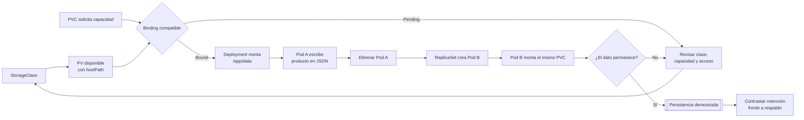

# Montar un volumen persistente para un servicio Python

## Información de la práctica

| Campo | Valor |
|---|---|
| **Duración contractual** | **41 minutos** |
| **Complejidad** | Media |
| **Producto** | `products-service` con datos persistentes |
| **Objetos** | StorageClass, PV, PVC y Deployment |

## Objetivo

Montar almacenamiento persistente en un servicio Python desplegado en Kubernetes y demostrar que los datos sobreviven a la recreación del Pod. La práctica distingue persistencia, política de retención y respaldo.

## Mapa del laboratorio



El resultado clave no es solo montar un volumen: deberá escribir un dato, forzar el reemplazo del Pod y verificar que el nuevo proceso recupera el mismo estado.

## Prerrequisitos

- Laboratorio 4 completado y namespace `microservicios-curso` disponible.
- minikube iniciado y `kubectl` conectado.
- Docker operativo para construir `products-service:2.0.0` o imagen equivalente ya publicada.
- Conocer la diferencia básica entre sistema de archivos del contenedor y volumen.

## Presupuesto de tiempo

| Actividad | Minutos |
|---|---:|
| Verificar entorno y versión persistente | 5 |
| Analizar StorageClass, PV y PVC | 8 |
| Aplicar almacenamiento y Deployment | 8 |
| Escribir datos y recrear el Pod | 10 |
| Inspeccionar retención y recuperación | 6 |
| Validación y cierre | 4 |
| **TOTAL** | **41** |

## Arquitectura

```text
products-service Pod
       │ /app/data
       ▼
      PVC ──solicita──> PV ──representa──> /mnt/data/products-service en minikube
       ▲                   │
       └── StorageClass ───┘
```

`hostPath` se usa únicamente porque minikube es un clúster local de un nodo. No representa una estrategia de almacenamiento recomendada para un clúster de producción.

## Material incluido

- `app/app/main.py`: versión del servicio que persiste en JSON.
- `app/Dockerfile`: imagen versionada `2.0.0`.
- `manifests/`: StorageClass, PV, PVC y Deployment con montaje.
- La guía original completa permanece en `revision_labs/backups/chapter05/README.before.md`.

## Paso 1 — Verificar entorno e imagen

**Tiempo sugerido: 5 minutos**

```bash
minikube status
kubectl get namespace microservicios-curso
docker build -t products-service:2.0.0 Capitulo05/app
minikube image load products-service:2.0.0
```

La carga directa a minikube evita publicar una segunda imagen durante esta práctica. En un entorno compartido puede sustituirla por una imagen `2.0.0` de un registro.

Revise `app/main.py` y localice:

- `DATA_FILE`, configurable mediante `DATA_DIR`;
- inicialización del JSON cuando aún no existe;
- escritura mediante archivo temporal y reemplazo;
- lectura en cada operación para evitar depender de memoria del proceso.

Esta implementación es deliberadamente pequeña. Un archivo JSON con un volumen `ReadWriteOnce` no convierte el servicio en una base de datos ni permite escrituras concurrentes seguras entre varias réplicas.

## Paso 2 — Analizar StorageClass, PV y PVC

**Tiempo sugerido: 8 minutos**

Complete la relación antes de aplicar:

| Objeto | Define o solicita | Decisión del laboratorio |
|---|---|---|
| StorageClass | Clase y modo de binding | `no-provisioner`, `WaitForFirstConsumer` |
| PV | Capacidad y ubicación real | 1 Gi, `hostPath`, `Retain` |
| PVC | Necesidad de la aplicación | 500 Mi, `ReadWriteOnce` |

Valide los archivos:

```bash
kubectl apply --dry-run=client -f Capitulo05/manifests/00-storageclass.yaml
kubectl apply --dry-run=client -f Capitulo05/manifests/01-pv.yaml
kubectl apply --dry-run=client -f Capitulo05/manifests/02-pvc.yaml
```

Compruebe que `storageClassName`, access mode y capacidad son compatibles. `Retain` conserva el volumen después de liberar el claim, pero no crea copias de seguridad.

## Paso 3 — Aplicar almacenamiento y Deployment

**Tiempo sugerido: 8 minutos**

```bash
kubectl apply -f Capitulo05/manifests/00-storageclass.yaml
kubectl apply -f Capitulo05/manifests/01-pv.yaml
kubectl apply -f Capitulo05/manifests/02-pvc.yaml
kubectl apply -f Capitulo05/manifests/03-deployment.yaml
kubectl -n microservicios-curso rollout status deployment/products-service --timeout=120s
kubectl get pv
kubectl -n microservicios-curso get pvc,pods
```

El PVC debe quedar `Bound`. En el Deployment identifique:

```yaml
volumeMounts:
  - name: products-data
    mountPath: /app/data
volumes:
  - name: products-data
    persistentVolumeClaim:
      claimName: products-pvc
```

La aplicación conoce `/app/data`; Kubernetes resuelve qué volumen satisface el claim.

## Paso 4 — Escribir datos y recrear el Pod

**Tiempo sugerido: 10 minutos**

Abra un port-forward:

```bash
kubectl -n microservicios-curso port-forward service/products-service 8000:80
```

En otra terminal:

```bash
curl -X POST http://127.0.0.1:8000/products \
  -H 'Content-Type: application/json' \
  -d '{"name":"Persistent keyboard","price":75,"stock":4}'
curl http://127.0.0.1:8000/products
```

Guarde el nombre del Pod y elimínelo:

```bash
OLD_POD=$(kubectl -n microservicios-curso get pod -l app=products-service -o jsonpath='{.items[0].metadata.name}')
kubectl -n microservicios-curso delete pod "$OLD_POD"
kubectl -n microservicios-curso rollout status deployment/products-service --timeout=120s
kubectl -n microservicios-curso get pods -l app=products-service
```

Restablezca port-forward si terminó al borrar el Pod y consulte nuevamente `/products`. El producto debe seguir presente aunque el nombre del Pod haya cambiado.

Compruebe el archivo montado sin modificarlo:

```bash
NEW_POD=$(kubectl -n microservicios-curso get pod -l app=products-service -o jsonpath='{.items[0].metadata.name}')
kubectl -n microservicios-curso exec "$NEW_POD" -- cat /app/data/products.json
```

## Paso 5 — Retención no es respaldo

**Tiempo sugerido: 6 minutos**

Inspeccione la relación y la política:

```bash
kubectl describe pv products-pv
kubectl -n microservicios-curso describe pvc products-pvc
minikube ssh -- sudo ls -l /mnt/data/products-service
```

Responda en una nota breve:

1. ¿Qué ocurre con los datos cuando se elimina solo el Pod?
2. ¿Qué protege `Retain` si se elimina el PVC?
3. ¿Qué riesgos siguen presentes si se pierde el nodo o se corrompe el archivo?
4. ¿Qué necesitaría un respaldo para permitir recuperación independiente?

No elimine el PVC durante la ruta principal. Borrar y volver a enlazar un PV estático requiere intervención manual y puede consumir el tiempo de práctica.

## Validación final

**Tiempo sugerido: 4 minutos**

- [ ] StorageClass, PV y PVC existen.
- [ ] PVC y PV muestran `Bound`.
- [ ] El Deployment monta `products-pvc` en `/app/data`.
- [ ] La API guarda al menos un producto.
- [ ] Un Pod nuevo recupera el producto anterior.
- [ ] Se explica por qué `Retain` no equivale a backup.

```bash
kubectl get pv products-pv
kubectl -n microservicios-curso get pvc products-pvc
```

## Resultado esperado

Un `products-service` con almacenamiento JSON montado mediante PVC y evidencia de que los datos sobreviven a la sustitución del Pod. Los recursos permanecen disponibles para laboratorios posteriores.

## Preguntas de cierre

1. ¿Por qué el Pod no debe depender de su sistema de archivos efímero?
2. ¿Qué diferencia existe entre PV y PVC?
3. ¿Por qué `ReadWriteOnce` y un archivo JSON limitan el escalado?
4. ¿Qué problema resuelve un backup que no resuelve la persistencia?

## Solución rápida de problemas

- PVC `Pending`: compare clase, capacidad, access mode y eventos del Pod.
- Permiso denegado en `/app/data`: revise `fsGroup` y permisos del directorio del nodo.
- Datos vacíos tras recrear el Pod: confirme que el Deployment monta el mismo claim.
- Imagen no encontrada: ejecute `minikube image load` y use `imagePullPolicy: IfNotPresent`.
- JSON corrupto: conserve el archivo como evidencia; no lo borre antes de analizar la causa.


## Fuentes

- https://kubernetes.io/docs/concepts/storage/persistent-volumes/
- https://kubernetes.io/docs/concepts/storage/storage-classes/
- https://kubernetes.io/docs/concepts/storage/volumes/#hostpath
