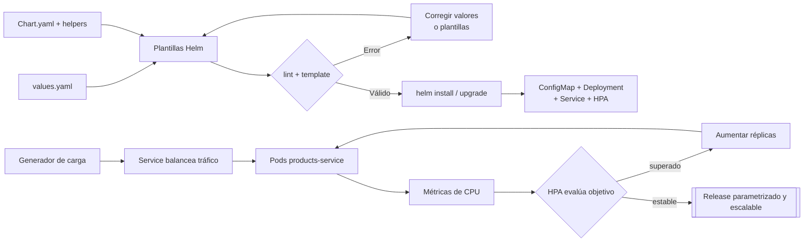

# Crear un chart de Helm y escalar un Deployment

## Información de la práctica

| Campo | Valor |
|---|---|
| **Duración contractual** | **41 minutos** |
| **Complejidad** | Media |
| **Producto** | Chart Helm de `products-service` con HPA |
| **Tecnologías** | Helm, Kubernetes, metrics-server |

## Objetivo

Parametrizar y desplegar `products-service` mediante un chart Helm, renderizar sus plantillas, verificar el balanceo del Service y observar el escalado automático de un Deployment con HPA.

## Mapa del laboratorio



La práctica conecta dos bucles: Helm convierte parámetros en recursos reproducibles y el HPA ajusta las réplicas a partir de carga observable.

## Prerrequisitos

- Laboratorios 3 y 4 completados: imagen `products-service:1.0.0` disponible y minikube operativo.
- Helm y `kubectl` instalados.
- Addon `metrics-server` habilitado antes de medir la práctica.
- El clúster dispone de recursos para ejecutar entre una y cuatro réplicas.

No se crea un servicio nuevo: se reutiliza `products-service` para conservar continuidad y dedicar el tiempo a Helm y escalado.

## Presupuesto de tiempo

| Actividad | Minutos |
|---|---:|
| Explorar el chart y sus plantillas | 7 |
| Configurar valores | 6 |
| Lint y renderizado | 7 |
| Instalar y verificar release | 8 |
| Balanceo y configuración | 4 |
| Generar carga y observar HPA | 7 |
| Validación y cierre | 2 |
| **TOTAL** | **41** |

## Flujo

```text
values.yaml + templates → helm template/lint → release
                                             ├── ConfigMap
                                             ├── Deployment → Pods
                                             ├── Service
                                             └── HPA → ajusta replicas
```

El chart completo está en `chart/products-service`. La actividad exige comprender y modificar los parámetros; no consiste en copiar cientos de líneas YAML.

## Paso 1 — Explorar el chart

**Tiempo sugerido: 7 minutos**

```bash
cd Capitulo06/chart/products-service
find . -maxdepth 2 -type f | sort
helm show chart .
```

Relacione cada archivo con su función:

| Archivo | Función |
|---|---|
| `Chart.yaml` | Identidad y versión del chart |
| `values.yaml` | Parámetros modificables |
| `_helpers.tpl` | Nombres y labels comunes |
| `deployment.yaml` | Pods, imagen, recursos y probes |
| `service.yaml` | Acceso estable y balanceo |
| `configmap.yaml` | Configuración no sensible |
| `hpa.yaml` | Réplicas según CPU |

Busque cómo `include`, `.Values` y `toYaml` separan datos de estructura. Confirme que las labels del selector son estables y no dependen de la versión del chart.

## Paso 2 — Configurar valores

**Tiempo sugerido: 6 minutos**

Edite `values.yaml`:

1. Cambie `image.repository` por su imagen publicada o mantenga `products-service` si la cargó en minikube.
2. Conserve una etiqueta versionada, `1.0.0`.
3. Revise requests de CPU: el HPA necesita una referencia para calcular utilización.
4. Mantenga HPA entre 1 y 4 réplicas, con objetivo de CPU de 50 %.
5. Cambie `config.appEnv` a `lab-helm` para comprobar la actualización.

```bash
grep -nE 'repository|tag|minReplicas|maxReplicas|averageUtilization|cpu:' values.yaml
```

## Paso 3 — Validar y renderizar

**Tiempo sugerido: 7 minutos**

```bash
helm lint .
helm template products-service . --namespace microservicios-curso > rendered.yaml
kubectl apply --dry-run=client --validate=false -f rendered.yaml
```

Inspeccione el resultado sin editarlo:

```bash
grep '^kind:' rendered.yaml
grep -nE 'image:|replicas:|averageUtilization|APP_ENV' rendered.yaml
```

Debe encontrar ConfigMap, Service, Deployment y HorizontalPodAutoscaler. `rendered.yaml` es evidencia temporal; la fuente de verdad continúa siendo el chart.

Pruebe un override sin cambiar archivos:

```bash
helm template products-service . --set autoscaling.maxReplicas=6 | grep -A3 maxReplicas
```

## Paso 4 — Instalar y verificar el release

**Tiempo sugerido: 8 minutos**

```bash
minikube addons enable metrics-server
kubectl create namespace microservicios-curso --dry-run=client -o yaml | kubectl apply -f -
helm upgrade --install products-service . -n microservicios-curso
helm list -n microservicios-curso
kubectl -n microservicios-curso rollout status deployment/products-service --timeout=120s
kubectl -n microservicios-curso get deployment,pods,service,hpa,configmap
```

Si la imagen es local:

```bash
minikube image load products-service:1.0.0
```

Confirme que Helm registra una revisión y que Kubernetes alcanza el estado declarado.

## Paso 5 — Verificar configuración y balanceo

**Tiempo sugerido: 4 minutos**

```bash
kubectl -n microservicios-curso port-forward service/products-service 8000:80
curl http://127.0.0.1:8000/products
```

Compruebe el valor renderizado y los endpoints seleccionados:

```bash
kubectl -n microservicios-curso get configmap products-service -o jsonpath='{.data.APP_ENV}{"\n"}'
kubectl -n microservicios-curso get endpoints products-service
```

El Service distribuye tráfico entre endpoints listos. No garantiza que unas pocas solicitudes visiten todos los Pods de forma uniforme.

## Paso 6 — Generar carga y observar HPA

**Tiempo sugerido: 7 minutos**

Espere hasta que existan métricas:

```bash
kubectl top pods -n microservicios-curso
kubectl get hpa -n microservicios-curso
```

Genere carga temporal desde el clúster:

```bash
kubectl run load-generator -n microservicios-curso --rm -it --restart=Never \
  --image=busybox:1.36 -- /bin/sh -c \
  'while true; do wget -q -O- http://products-service/products >/dev/null; done'
```

En otra terminal:

```bash
kubectl get hpa,pods -n microservicios-curso -w
```

Detenga la carga con `Ctrl+C`. El HPA puede tardar en escalar y reducir réplicas debido a ventanas de muestreo y estabilización. El resultado válido es observar métricas y explicar la decisión del controlador; no prometa un tiempo exacto.

## Validación final

**Tiempo sugerido: 2 minutos**

- [ ] `helm lint` termina sin errores.
- [ ] `helm template` genera cuatro objetos.
- [ ] El release aparece en `helm list`.
- [ ] Deployment está disponible y Service tiene endpoints.
- [ ] HPA muestra una métrica de CPU o se documenta el warning de metrics-server.
- [ ] Se observó un cambio de réplicas o se explicó por qué la carga no superó el objetivo.

```bash
helm get values products-service -n microservicios-curso
helm get manifest products-service -n microservicios-curso | grep '^kind:'
```

## Resultado esperado

Un chart Helm reutilizable que despliega `products-service`, parametriza imagen y configuración, define recursos, expone un Service y permite que HPA ajuste las réplicas según CPU.

## Preguntas de cierre

1. ¿Qué pertenece a `values.yaml` y qué debe permanecer en un template?
2. ¿Por qué el HPA necesita `resources.requests.cpu`?
3. ¿Qué diferencia existe entre `helm template`, `install` y `upgrade`?
4. ¿Cómo conserva Service un destino estable mientras cambian los Pods?

## Solución rápida de problemas

- HPA muestra `<unknown>`: espere métricas, revise metrics-server y requests de CPU.
- `ImagePullBackOff`: cargue la imagen en minikube o use un repositorio accesible.
- `helm upgrade` falla: ejecute primero `helm lint` y revise `helm template`.
- Service sin endpoints: compare selectors, labels y readiness.
- No escala: confirme que la carga consume CPU suficiente; la API ligera puede no superar 50 %.

## Nota para el instructor

- Active metrics-server y precargue la imagen antes de iniciar el cronómetro.
- No reconstruya el microservicio ni el clúster durante esta práctica.
- Considere PASS técnico si chart/release/HPA son correctos aunque una máquina rápida no escale con la carga breve.
- Puede conservar el release para exploración posterior; el laboratorio 7 es independiente y no lo requiere.

## Ampliación opcional fuera del tiempo contractual

La guía original, preservada en `revision_labs/backups/chapter06/README.before.md`, incluye crear un `inventory-service`, escribir el chart desde cero, RollingUpdate, pruebas extensas y commits Git. Esos contenidos pueden utilizarse después de la ruta contractual.

## Fuentes

- https://helm.sh/docs/topics/charts/
- https://helm.sh/docs/chart_template_guide/
- https://kubernetes.io/docs/tasks/run-application/horizontal-pod-autoscale/
