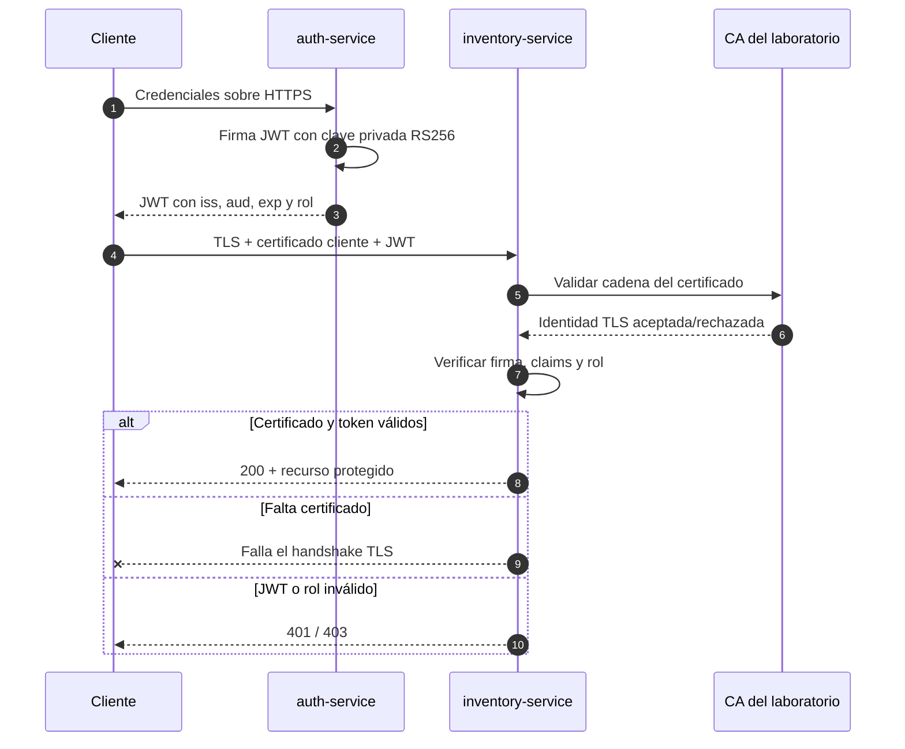

# Implementar autenticación JWT y TLS entre servicios

## Información de la práctica

| Campo | Valor |
|---|---|
| **Duración contractual** | **41 minutos** |
| **Complejidad** | Alta |
| **Producto** | Token RS256 y endpoint HTTPS protegido |
| **Tecnologías** | FastAPI, JWT, OpenSSL y TLS mutuo |

## Objetivo

Emitir y validar tokens JWT firmados con RS256, aplicar autorización por rol y proteger la comunicación HTTPS entre dos servicios mediante certificados de laboratorio. El token prueba identidad y permisos; TLS protege el canal. Son controles distintos y complementarios.

## Mapa del laboratorio



El laboratorio demostrará controles independientes en capas: primero identidad del canal con mTLS y después identidad y autorización de la petición con JWT.

## Prerrequisitos

- Python 3.12, OpenSSL y terminal disponibles.
- Conceptos de clave privada/pública, certificado y HTTP.
- Puertos 8441 y 8442 libres.
- No se requiere Kubernetes durante la ruta principal.

Los certificados son autofirmados y exclusivos del laboratorio. No reutilice las claves ni contraseñas de ejemplo.

## Presupuesto de tiempo

| Actividad | Minutos |
|---|---:|
| Preparar entorno y generar material criptográfico | 7 |
| Revisar emisión y claims JWT | 8 |
| Completar validación y autorización | 9 |
| Iniciar servicios con TLS mutuo | 7 |
| Ejecutar pruebas positivas y negativas | 8 |
| Validación y cierre | 2 |
| **TOTAL** | **41** |

## Flujo de seguridad

```text
Cliente ──credenciales──> auth-service
Cliente <── JWT RS256 ─── auth-service (firma con clave privada)

Cliente/servicio ── TLS + certificado cliente + JWT ──> inventory-service
inventory-service valida:
  1. certificado contra la CA;
  2. firma JWT con clave pública;
  3. iss, aud y exp;
  4. rol requerido.
```

## Material incluido

`app/` contiene los dos servicios y scripts de arranque. `scripts/generate_certs.sh` genera claves y certificados localmente; `certs/` está ignorado por Git.

## Paso 1 — Preparar y generar certificados

**Tiempo sugerido: 7 minutos**

```bash
cd Capitulo07
python -m venv .venv
source .venv/bin/activate
python -m pip install -r app/requirements.txt
bash scripts/generate_certs.sh
```

En PowerShell active el entorno con `.\.venv\Scripts\Activate.ps1`; puede ejecutar el script desde Git Bash.

En Windows sin Bash, genere el mismo material con:

```powershell
.\scripts\generate_certs.ps1
```

Verifique sin mostrar claves privadas:

```bash
openssl verify -CAfile certs/ca.crt certs/auth-service.crt certs/inventory-service.crt certs/client.crt
openssl pkey -in certs/jwt-private.pem -check -noout
openssl pkey -pubin -in certs/jwt-public.pem -text -noout | head
```

La clave JWT privada solo pertenece a `auth-service`. `inventory-service` recibe únicamente la clave pública.

## Paso 2 — Revisar emisión y claims

**Tiempo sugerido: 8 minutos**

Abra `app/auth_service.py` e identifique:

- algoritmo permitido: `RS256`;
- `sub`: identidad del usuario;
- `roles`: permisos de la demostración;
- `iss`: emisor esperado;
- `aud`: servicio destinatario;
- `iat` y `exp`: emisión y expiración.

JWT está firmado, no cifrado. Cualquiera que obtenga el token puede leer su payload; no coloque secretos ni datos personales innecesarios.

El endpoint `POST /token` usa dos usuarios locales de demostración. Explique qué cambiaría en producción: almacenamiento de contraseñas, rate limiting, rotación de claves y proveedor de identidad.

## Paso 3 — Completar validación y autorización

**Tiempo sugerido: 9 minutos**

En `app/inventory_service.py`, localice los tres marcadores `TODO`, explique qué riesgo cubre cada control y altere temporalmente uno por vez para observar cómo cambia el resultado de las pruebas:

1. limite el algoritmo aceptado a `RS256`;
2. exija `issuer="https://auth-service.local"`;
3. exija `audience="inventory-service"`.

Después, confirme que `require_role("admin")` responde:

- 401 cuando no hay token, la firma falla o el token expiró;
- 403 cuando el token es válido pero no contiene el rol requerido.

No escriba un decodificador JWT propio y no confunda decodificar Base64URL con validar una firma.

## Paso 4 — Iniciar servicios con TLS

**Tiempo sugerido: 7 minutos**

Terminal 1:

```bash
python app/run_auth.py
```

Terminal 2:

```bash
python app/run_inventory.py
```

`inventory-service` exige un certificado de cliente firmado por la CA. Los nombres `auth-service.local` e `inventory-service.local` están incluidos como SAN; para la prueba local, curl se conecta a `127.0.0.1` mediante `--resolve`.

> En Windows, `curl.exe` usa Schannel y puede rechazar certificados PEM de cliente o intentar una comprobación de revocación no disponible en este laboratorio. Si ocurre, ejecute las verificaciones automatizadas con `pytest` (usan `httpx`) o realice estos comandos desde Git Bash/WSL. No desactive la validación TLS con `-k`.

## Paso 5 — Probar controles positivos y negativos

**Tiempo sugerido: 8 minutos**

Obtenga un token de administrador verificando la CA:

```bash
TOKEN=$(curl -s --cacert certs/ca.crt \
  --resolve auth-service.local:8441:127.0.0.1 \
  -X POST https://auth-service.local:8441/token \
  -H 'Content-Type: application/json' \
  -d '{"username":"admin","password":"lab-admin"}' | python -c 'import json,sys; print(json.load(sys.stdin)["access_token"])')
```

Prueba correcta: CA, certificado de cliente y JWT:

```bash
curl --cacert certs/ca.crt --cert certs/client.crt --key certs/client.key \
  --resolve inventory-service.local:8442:127.0.0.1 \
  -H "Authorization: Bearer $TOKEN" \
  https://inventory-service.local:8442/inventory
```

Ejecute también las pruebas negativas:

```bash
# Sin certificado cliente: el handshake TLS debe fallar.
curl --cacert certs/ca.crt --resolve inventory-service.local:8442:127.0.0.1 \
  -H "Authorization: Bearer $TOKEN" https://inventory-service.local:8442/inventory

# Con mTLS pero sin JWT: debe responder 401.
curl --cacert certs/ca.crt --cert certs/client.crt --key certs/client.key \
  --resolve inventory-service.local:8442:127.0.0.1 \
  https://inventory-service.local:8442/inventory
```

Obtenga un token del usuario `viewer` con contraseña `lab-viewer` y confirme que `/inventory` responde 403: el canal y el token son válidos, pero falta autorización.

## Validación final

**Tiempo sugerido: 2 minutos**

- [ ] Los certificados verifican contra la CA.
- [ ] El header JWT declara RS256.
- [ ] Se validan firma, `iss`, `aud` y `exp`.
- [ ] Admin obtiene 200.
- [ ] Sin certificado cliente falla TLS.
- [ ] Sin token se obtiene 401.
- [ ] Viewer se autentica, pero obtiene 403.

```bash
python -m pytest app/tests -q
```

## Resultado esperado

Dos servicios HTTPS de laboratorio: `auth-service` emite JWT RS256 y `inventory-service` exige mTLS, valida el token y autoriza únicamente el rol admin.

## Preguntas de cierre

1. ¿Qué protege la firma JWT y qué no protege?
2. ¿Qué aporta TLS además del token?
3. ¿Por qué se validan `iss` y `aud`?
4. ¿Cuándo corresponde 401 y cuándo 403?

## Solución rápida de problemas

- Error de hostname: use `--resolve` y no desactive la verificación TLS.
- `CERTIFICATE_VERIFY_FAILED`: compruebe CA, SAN y reloj del equipo.
- `Invalid audience`: confirme `aud=inventory-service`.
- 403 con token admin: revise que `roles` sea una lista e incluya `admin`.
- Archivo de clave no encontrado: ejecute desde `Capitulo07`.

## Nota para el instructor

- Genere certificados e instale dependencias antes del cronómetro si la red es lenta.
- No presente certificados autofirmados como práctica de producción.
- Destaque las cuatro capas: canal, firma, claims y rol.
- El despliegue de Secrets/Helm queda como extensión para no desplazar el objetivo JWT+TLS.

## Ampliación opcional fuera del tiempo contractual

La guía original, preservada en `revision_labs/backups/chapter07/README.before.md`, incluye Dockerfiles, Secrets Kubernetes, extensión del chart Helm y once pruebas end-to-end. Puede ejecutarse después de la ruta principal.

## Fuentes

- https://datatracker.ietf.org/doc/html/rfc7519
- https://fastapi.tiangolo.com/tutorial/security/oauth2-jwt/
- https://docs.python.org/3/library/ssl.html
