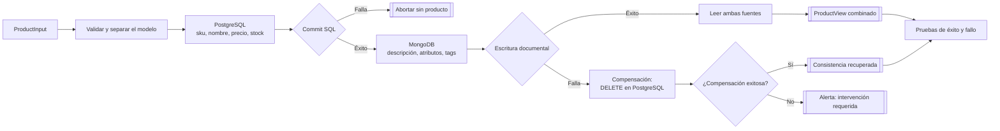

# Persistencia híbrida (PostgreSQL + MongoDB) para un servicio

## Información de la práctica

| Campo | Valor |
|---|---|
| Duración contractual | **41 minutos** |
| Proyecto | `catalog-service` |
| Tecnologías | Python, PostgreSQL 16.3, MongoDB 7.0.11, SQLAlchemy y Motor |
| Archivos principales | `app/`, `compose.yaml`, `tests/` |
| Resultado observable | Un producto distribuido entre SQL y NoSQL; un fallo documental activa compensación |

## Objetivo

Implementar persistencia políglota: guardar el núcleo transaccional de un producto en PostgreSQL y sus atributos variables en MongoDB. Coordinar ambas escrituras mediante una Saga con compensación explícita y comprobar el camino exitoso y el fallo de la segunda operación.

Las dos bases no forman una sola transacción ACID. Entre el `commit` SQL y la escritura documental existe una ventana de inconsistencia. La compensación reduce el riesgo, pero en producción requiere idempotencia, reintentos, observabilidad y normalmente mensajería durable u outbox.

## Mapa del laboratorio



Se implementarán y comprobarán los dos caminos de una Saga: composición exitosa de datos SQL/NoSQL y eliminación compensatoria cuando falla la segunda escritura.

## Presupuesto temporal

| Actividad | Minutos |
|---|---:|
| Preparación y arranque | 7 |
| Inspección del modelo híbrido | 7 |
| Implementación de la Saga | 11 |
| Ejecución y consulta | 8 |
| Prueba de compensación | 6 |
| Cierre | 2 |
| **TOTAL** | **41** |

## Prerrequisitos

- Python 3.12 según la baseline del curso.
- Docker Engine y Docker Compose.
- Puertos `5432` y `27017` libres.
- Conceptos de SQL, documentos y transacciones distribuidas del capítulo 8.

No depende del laboratorio 7: autenticación no forma parte del objetivo contractual de esta práctica.

## Arquitectura

```text
ProductInput
  +--> PostgreSQL: id, sku, name, price, stock -- commit
  +--> MongoDB: product_id, description, attributes, tags
         +-- éxito --> ProductView combinado
         +-- fallo --> DELETE compensatorio en PostgreSQL
```

PostgreSQL conserva campos con reglas estables, restricciones y actualización transaccional. MongoDB conserva datos variables. La frontera responde al dominio, no a una regla universal de “SQL frente a NoSQL”.

## Paso 1 — Preparar el entorno (7 min)

Desde `Capitulo08`:

```bash
docker compose up -d
docker compose ps
python -m venv .venv
source .venv/bin/activate
pip install -r requirements.txt
```

En PowerShell active con `\.venv\Scripts\Activate.ps1`.

```bash
docker compose exec postgres pg_isready -U catalog -d catalog
docker compose exec mongo mongosh --quiet --username catalog --password catalog-lab --authenticationDatabase admin --eval "db.adminCommand({ping:1}).ok"
```

Espere a que ambos servicios estén `healthy`. Las credenciales de `compose.yaml` son solo para el entorno local.

## Paso 2 — Reconocer el modelo híbrido (7 min)

Revise:

- `app/models.py`: entidad SQL con `sku` único y valores restringidos.
- `app/repositories.py`: contratos y adaptadores reales.
- `app/schemas.py`: entrada y vista independientes de los motores.

```bash
python -m app.bootstrap
```

El comando crea la tabla SQL y el índice único de `product_id` en MongoDB de forma idempotente. `price` usa `NUMERIC`, no `float`, para evitar errores binarios en importes.

## Paso 3 — Analizar la Saga (11 min)

Abra `app/service.py` y ubique los marcadores `LAB`:

1. guardar el registro transaccional;
2. guardar el documento flexible;
3. ante el segundo fallo, eliminar el registro SQL mediante compensación;
4. si también falla la compensación, elevar `CompensationFailed` conservando ambas causas.

El archivo contiene una referencia ejecutable. En parejas, expliquen la ruta feliz, identifiquen ventanas de fallo y alteren temporalmente una llamada para comprobar qué prueba detecta la regresión.

Una compensación no equivale a `rollback`: ocurre después de confirmar la primera transacción y es una nueva operación de negocio que debe tolerar repetición.

## Paso 4 — Ejecutar persistencia real (8 min)

```bash
python -m app.demo
docker compose exec postgres psql -U catalog -d catalog -c "SELECT id, sku, name, price, stock FROM products;"
docker compose exec mongo mongosh --quiet --username catalog --password catalog-lab --authenticationDatabase admin catalog_details --eval "db.product_details.find({}, {_id:0}).toArray()"
```

Debe imprimirse una vista combinada y el producto debe aparecer en ambos motores. La relación es `products.id == product_details.product_id`; no existe una llave foránea entre bases.

## Paso 5 — Validar éxito y compensación (6 min)

```bash
pytest -q
```

Las pruebas cubren creación, lectura combinada, compensación por fallo documental y fallo doble. Después observe el escenario real:

```bash
docker compose stop mongo
python -m app.demo
docker compose exec postgres psql -U catalog -d catalog -c "SELECT sku FROM products WHERE sku='TV-4K-LAB';"
docker compose start mongo
```

La demo debe fallar y la consulta no debe devolver `TV-4K-LAB`. En una ejecución normal se eliminan previamente tanto la fila SQL como los documentos Mongo identificados por ese SKU. Si MongoDB está detenido, se omite únicamente la limpieza documental para poder observar la compensación SQL.

## Validación final (2 min)

- [ ] Ambos motores están saludables.
- [ ] El producto aparece en ambos con el mismo identificador lógico.
- [ ] Las pruebas automatizadas pasan.
- [ ] Al detener MongoDB, la escritura SQL queda compensada.
- [ ] Puede explicar por qué hay consistencia eventual, no atomicidad global.

## Resultado esperado

Un servicio Python separa datos transaccionales y documentales, recompone una vista y ejecuta una compensación observable si MongoDB falla después del commit SQL.

## Solución rápida de problemas

- **Puerto ocupado:** cambie únicamente el puerto publicado en `compose.yaml`.
- **Contenedor no saludable:** revise `docker compose logs postgres mongo`.
- **`ModuleNotFoundError`:** active `.venv` y reinstale `requirements.txt`.
- **MongoDB detenido:** recupérelo con `docker compose start mongo`.

## Limpieza

```bash
docker compose down
```

Use `docker compose down -v` únicamente si desea borrar definitivamente los datos. La guía original con FastAPI, JWT, Alembic y pruebas extensas se conserva en `revision_labs/backups/chapter08/README.before.md` como ampliación opcional fuera de los 41 minutos.


