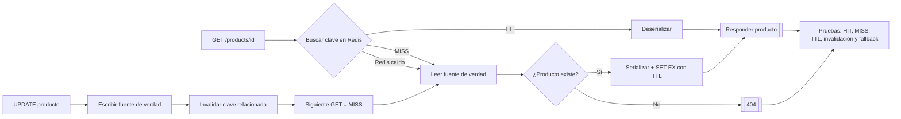

# Implementar caching con Redis en un servicio Python

## Información de la práctica

| Campo | Valor |
|---|---|
| Duración contractual | **41 minutos** |
| Patrón principal | Cache-aside |
| Tecnología | Redis 7.2.5, Python y `redis-py` |
| Archivos | `app/cache.py`, `app/service.py`, `tests/test_cache.py` |
| Resultado observable | MISS → HIT, TTL visible, invalidación tras escritura y fallback ante fallo |

## Objetivo

Implementar cache-aside para lecturas de productos, serializar datos de forma estable, asignar TTL e invalidar entradas relacionadas después de una escritura. El servicio debe seguir leyendo desde su repositorio cuando Redis no esté disponible.

La caché acelera lecturas, pero introduce datos potencialmente obsoletos. Redis no se convierte en fuente de verdad: la base persistente conserva esa responsabilidad.

## Mapa del laboratorio



El recorrido hace visibles las decisiones de cache-aside: cuándo consultar Redis, cómo repoblarlo, cuándo invalidar y cómo continuar si la caché deja de responder.

## Presupuesto temporal

| Actividad | Minutos |
|---|---:|
| Preparación de Redis | 6 |
| Cache-aside y claves | 10 |
| TTL y serialización | 7 |
| Invalidación | 8 |
| Fallo de caché y pruebas | 8 |
| Cierre | 2 |
| **TOTAL** | **41** |

## Prerrequisitos

- Python 3.12 según la baseline del curso.
- Docker Engine y Docker Compose.
- Puerto `6379` disponible.
- Conceptos de cache-aside, TTL e invalidación revisados en el capítulo 9.

El repositorio en memoria representa la fuente persistente para mantener el ejercicio dentro de 41 minutos; puede sustituirse por el adaptador PostgreSQL/MongoDB del laboratorio 8 como ampliación.

## Flujo

```text
GET product
   |
   +-- Redis HIT  ----------> deserializar y responder
   |
   +-- Redis MISS/fallo ----> repositorio --> serializar + SET EX

UPDATE product --> repositorio --> invalidar clave --> siguiente GET = MISS
```

## Paso 1 — Preparar Redis (6 min)

```bash
docker compose up -d --wait
docker compose exec redis redis-cli ping
python -m venv .venv
source .venv/bin/activate
pip install -r requirements.txt
```

En PowerShell active con `\.venv\Scripts\Activate.ps1`. El resultado de `PING` debe ser `PONG`.

La imagen está fijada y Redis usa una política LRU con límite de memoria para que la evicción pueda discutirse. TTL e invalidación siguen siendo necesarios: evicción no significa frescura.

## Paso 2 — Analizar cache-aside y las claves (10 min)

Revise `app/service.py`:

1. se construye la clave `catalog:product:{id}:v1`;
2. se intenta leer Redis;
3. ante MISS se consulta la fuente de verdad;
4. el resultado se escribe con TTL antes de responder.

El prefijo identifica dominio y recurso; `v1` permite cambiar el esquema serializado sin confundir entradas antiguas. No use `KEYS` en el camino de producción porque recorre todo el espacio de claves.

## Paso 3 — TTL y serialización (7 min)

`app/cache.py` usa JSON UTF-8, no `pickle`: el formato es interoperable y no ejecuta objetos arbitrarios al deserializar. El TTL se fija en cada `SET`.

Arranque la demostración:

```bash
python -m app.demo
docker compose exec redis redis-cli TTL catalog:product:p-1:v1
docker compose exec redis redis-cli GET catalog:product:p-1:v1
```

La demo debe mostrar primero `MISS` y después `HIT`. El TTL debe ser positivo y no superar 60 segundos.

## Paso 4 — Invalidar después de escribir (8 min)

Ubique los marcadores `LAB` de `update_product()`:

- primero se actualiza la fuente de verdad;
- después se elimina la entrada del producto;
- la siguiente lectura repuebla la caché con el valor nuevo.

Ejecute otra vez la demo y observe la secuencia `MISS → HIT → INVALIDATE → MISS`. Invalidar antes de confirmar la escritura abriría una carrera en la que otra petición podría recargar el valor anterior.

Para listas o consultas agregadas se necesitaría invalidar más claves, usar tags/versiones o aceptar una ventana de obsolescencia. Este laboratorio limita deliberadamente la clave a detalle de producto.

## Paso 5 — Comprobar degradación y pruebas (8 min)

```bash
pytest -q
docker compose stop redis
python -m app.demo
docker compose start redis
```

Con Redis detenido la demo debe seguir devolviendo productos desde el repositorio y registrar `BYPASS`; el rendimiento baja, pero la operación de lectura no falla. Las escrituras también continúan si la invalidación no está disponible, por lo que al recuperarse Redis podría quedar una entrada obsoleta hasta expirar: ese riesgo justifica TTL y métricas.

Las pruebas cubren:

- MISS que consulta repositorio y llena caché;
- HIT que evita una segunda consulta;
- expiración lógica mediante TTL del fake;
- invalidación después de actualizar;
- fallback cuando la caché falla.

## Validación final (2 min)

- [ ] `redis-cli ping` responde `PONG`.
- [ ] La segunda lectura es HIT.
- [ ] La clave tiene TTL positivo.
- [ ] Actualizar invalida y la lectura siguiente devuelve el valor nuevo.
- [ ] El servicio lee la fuente de verdad si Redis falla.
- [ ] Puede explicar el riesgo de datos obsoletos.

## Resultado esperado

Un servicio con cache-aside observable, claves versionadas, JSON, TTL de 60 segundos, invalidación posterior a escritura y degradación controlada ante indisponibilidad de Redis.

## Solución rápida de problemas

- **Puerto 6379 ocupado:** cambie el puerto publicado; no cambie el puerto interno.
- **No aparece HIT:** confirme que ejecuta dos lecturas del mismo ID y revise el TTL.
- **Valor anterior tras actualizar:** verifique el `delete` posterior al repositorio.
- **Redis detenido:** recupérelo con `docker compose start redis`.

## Limpieza

```bash
docker compose down
```

La guía original con decoradores genéricos, FastAPI y benchmarking con Locust se conserva en `revision_labs/backups/chapter09/README.before.md` como ampliación opcional fuera del recorrido contractual.


